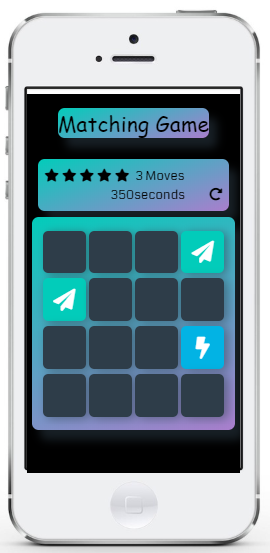

# Memory Game Project

## Rules 
there are 1 pair of each card .i.e 2. 
1:click the  random card to see its content and click another random card  
2:if two cards are matched then they will be open else they are not going to open.
3;in order to win you have to matched all the card with their pair.
4:for good rating you have to matched all card in minimun moves.
### lets play game <a href="https://shadab97.github.io/fend-project-memory-game/">click</a>
## Screenshot

